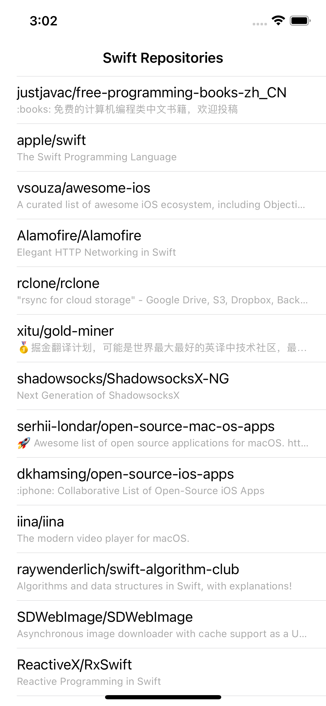
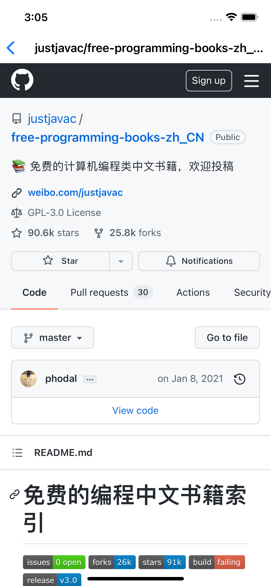

# GitRepos (Model, View, View Model)

## Sample App





### Architecture


## Description
  
GitRepos is follwing MVVM  architecture.   

### View (including UIViewController)
View must implement Viewable. Viewable has Default Extension.  
※ View is not just View like UIView etc in this case.

```swift

protocol Viewable: AnyObject {
    func push(_ vc: UIViewController, animated: Bool)
    func pop(animated: Bool)
}

extension Viewable where Self: UIViewController {

    func push(_ vc: UIViewController, animated: Bool) {
        self.navigationController?.pushViewController(vc, animated: animated)
    }

    func pop(animated: Bool) {
        self.navigationController?.popViewController(animated: animated)
    }

    var supportedInterfaceOrientations: UIInterfaceOrientationMask {
        return .portrait
    }
    var preferredInterfaceOrientationForPresentation: UIInterfaceOrientation {
        return .portrait
    }

}
```

Example

```swift

protocol ListViewInputs: AnyObject {
    func configure(entities: ListEntities?)
    func reloadTableView()
    func indicatorView(animate: Bool)
}

final class ListViewController: UIViewController {

    internal var viewModel: ListViewModel?
    internal var router: ListRouterOutput?
    
    @IBOutlet private weak var tableView: UITableView! {
        didSet {
            tableView.delegate = self
            tableView.dataSource = self
        }
    }
    
    @IBOutlet private weak var indicatorView: UIActivityIndicatorView!

    
    override func viewDidLoad() {
        super.viewDidLoad()
        configure(entities: viewModel?.entities)
        let request = SearchLanguageRequest(language:"Swift", page:1)

        viewModel?.fetchSearch(request: request)
    }

}

extension ListViewController: ListViewInputs {}

extension ListViewController: Viewable {}

```

### ViewModel
ViewModel handles all interaction with the model.

Example
```swift

class ListViewModel {
    
    var entities: ListEntities
    private var gitHubApi: GitHubApiType
    private weak var view: ListViewInputs!
    
    init(gitHubApi: GitHubApiType, entities: ListEntities, view: ListViewInputs ) {
        self.gitHubApi = gitHubApi
        self.entities = entities
        self.view = view
    }
    
    func fetchSearch(request: SearchLanguageRequest) {
        fetchRepo(request: request)
    }

```

###Model
Contains the functions to retrieve the information for the ViewModel.

Example
```swift

public enum HttpMethod: String {
    case get = "GET"
    case post = "POST"
}

public protocol Request {
    var url: String { get }
    func params() -> [(key: String, value: String)]
}

protocol ApiProtocol {
    func request(_ httpMethod: HttpMethod, request: Request, onSuccess: @escaping (Data, URLResponse?) -> Void, onError: @escaping (Error) -> Void)

}

open class ApiTask: ApiProtocol {

    public var httpHeader: [String: String]? = ["content-type": "application/json"]
    public var timeoutInterval: TimeInterval = 60
    public var cachePolicy: URLRequest.CachePolicy = .reloadIgnoringLocalCacheData
    static let apiTaskSession: URLSession = URLSession(configuration: URLSessionConfiguration.ephemeral)

    public init() {}

    public func request(_ httpMethod: HttpMethod, request: Request, onSuccess: @escaping (Data, URLResponse?) -> Void, onError: @escaping (Error) -> Void) {
        
        guard let urlRequest = URLRequestCreator.create(httpMethod: httpMethod,
                                                  request: request,
                                                  header: httpHeader,
                                                  timeoutInterval: timeoutInterval,
                                                        cachePolicy: cachePolicy) else {
            return
        }
        let task = ApiTask.apiTaskSession.dataTask(with: urlRequest, completionHandler: {(data, response, error) in
            
            if let error = error {
                onError(error)
                return
            }
            if let responseError = ApiTask.check(response: response) {
                onError(responseError)
                return
            }
            guard let data = data else {
                onError(ApiError.recieveNilBody)
                return
            }
            onSuccess(data, response)
        })
        task.resume()
    }

```

### Unit Test 
 
* Used XCTest framework
* Created fakeApiTask class to input this class to mock api behaviour 

## Requirements

- Xcode 13.0+
- Swift 5.2+

## Author

Mindaugas Balakauskas 
